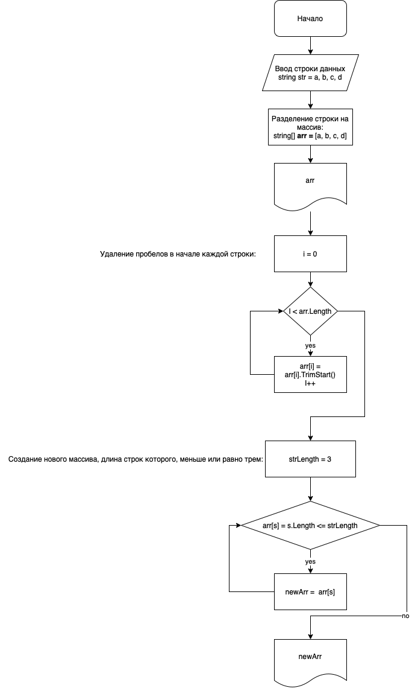

# Итоговая проверочная работа за 1 четверть.

## Задание:
Написать программу, которая из имеющегося массива строк формирует массив из строк, длина которых меньше либо равна 3 символам. Первоначальный массив можно ввести с клавиатуры, либо задать на старте выполнения алгоритма. При решении не рекомендуется использовать коллекции, лучше обойтись исключительно массивами.

## Блок-схема алгоритма:

## Описание решения:
1. Программа начинается с определения метода **GetArray**, который предлагает пользователю ввести строку значений, разделенных запятыми. 
    * Метод принимает строку в качестве входного параметра, выводит ее на консоль, считывает строку, введенную пользователем с помощью `Console.ReadLine()`, и присваивает ее переменной *str*. Оператор объединения с нулевым значением используется для присвоения пустой строки переменной str, __если `Console.ReadLine()` возвращает значение null__.
    Затем переменная str разбивается на массив строк с использованием метода `Split()` и *запятых в качестве разделителя*. Условный оператор **null** используется для обработки случая, когда str имеет значение null. Если str имеет значение null, то метод Split() **не** выполняется, а с помощью метода `Array.Empty<string>()` возвращается массив пустых строк. Результирующий массив строк возвращается методом.

2. Затем программа определяет метод **PrintArray**, который принимает массив строк в качестве входных данных и печатает значения, заключенные в квадратные скобки, разделенные запятыми.
    * Он использует *цикл for* для перебора каждого элемента массива и вывода его на консоль. Если элемент не является последним элементом массива, запятая и пробел также печатаются для разделения элементов.

3. В программе определен еще один метод **DelStrStartSpace**, который принимает массив строк в качестве входных данных и удаляет все *начальные пробелы* из каждой строки.
    * Он использует *цикл for* для перебора каждого элемента массива и вызывает метод `TrimStart()` для удаления всех начальных пробелов.

4. В программе определен еще один метод **GetStrArrSpecificLength**, который принимает на вход массив строк и целочисленное значение. Метод фильтрует массив и возвращает только те строки, длина которых меньше или равна входному целочисленному значению.
    * Он использует метод *LINQ `Where()`* для фильтрации элементов входного массива на основе длины каждой строки.

### Код вне методов:
5. Этот код вызывает метод **GetArray()** с сообщением *"Ввести значения через запятую: "* в качестве параметра для получения массива строк от пользователя. Полученный массив выводится на консоль с помощью метода **PrintArray()**.
Затем вызывается метод **DelStrStartSpace()** для удаления всех начальных пробелов из каждого элемента массива. Полученный массив выводится на консоль с помощью метода **PrintArray()**.
Наконец, вызывается метод **GetStrArrSpecificLength()** с измененным массивом и целочисленным значением 3 в качестве параметров. Полученный массив выводится на консоль с помощью метода **PrintArray()**.

> Этот код может обрабатывать введенные пустые строки и возвращать пустой массив. Также, он не считает пробелы сначала строки, так как удаляет их.
